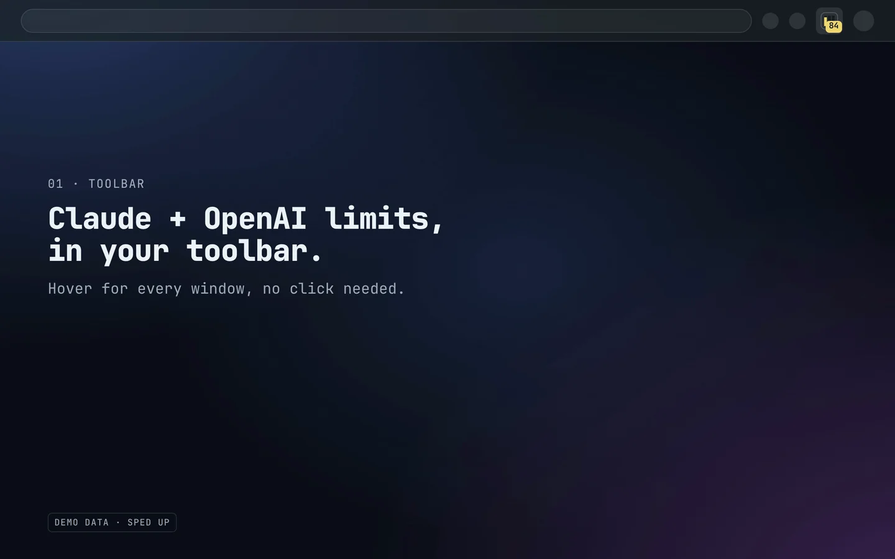

# MeterBar

A privacy-first Chrome extension for personal AI subscription usage limits, plus an optional experimental Omarchy display preview.

<picture>
  <source media="(prefers-reduced-motion: reduce) and (prefers-color-scheme: light)" srcset="docs/media/meterbar-demo-poster-light.png">
  <source media="(prefers-reduced-motion: reduce)" srcset="docs/media/meterbar-demo-poster-dark.png">
  <source media="(prefers-color-scheme: light)" srcset="docs/media/meterbar-demo-light.webp">
  
</picture>

<sub>Demo data, sped up. The provider endpoints are undocumented, so every reading is marked "inferred" (or "unofficial source" in tooltips and alerts). [Watch the MP4](docs/media/meterbar-demo.mp4) · [Permissions and privacy](#permissions-and-privacy) · Not on the Chrome Web Store yet: [build from source](#local-development).</sub>

## Product thesis

AI power users increasingly juggle Claude, ChatGPT/Codex, Gemini, and other AI subscriptions without a single place to see remaining limits. MeterBar is a personal Chrome extension that surfaces usage caps before they interrupt work. It has no account system, cloud sync, or team dashboard.

## Status

The Chrome MVP and Phase 2 browser tracking are implemented. The glass dashboard spans the toolbar, popup, side panel, and settings. The popup shows a hero readout of the tightest limit, a multi-provider 24-hour trend chart, and per-provider detail cards with two switchable views (home and limits). The toolbar icon draws a risk-colored bar per provider in a fixed three-slot casing (Claude, OpenAI, Gemini) plus a badge number you can pin to a group (Auto, Claude, or OpenAI). ChatGPT and Codex share one OpenAI card reading from the same endpoint. Claude, ChatGPT, and Codex read live usage via background fetches of your logged-in sessions; Gemini reports connected-status via a content script. All numeric readings are labeled "inferred" - the endpoints are undocumented, so MeterBar never presents them as exact.

An optional experimental Omarchy preview adds the same three-channel indicator and a click-open desktop panel using a sanitized local snapshot. It is display-only and not a stable product surface: the Chrome extension remains the only collector, and no CLI tracking, local proxy, routing, or failover is included.

### Viewing your usage without clicking

- **Badge** - the pinned toolbar icon always shows your single riskiest percentage, color-coded.
- **Hover tooltip** - hover the icon for a full per-provider, per-window summary with confidence qualifiers, no click needed.
- **Side panel** - open it once (the **Side panel** button in the popup, or Chrome's side-panel toolbar button) and it stays docked and glanceable while you browse, refreshing itself as new usage arrives.
- **Omarchy bar preview** - install the optional [experimental display preview](companion/README.md) for an always-visible shell indicator and click-open glass panel with its own 24-hour trend chart.

## Local development

```bash
npm install
npm test            # vitest run (all suites)
npm run typecheck   # tsc --noEmit
npm run check       # typecheck + test
npm run build       # vite build → dist/ (the unpacked extension)
npm run assets:generate  # regenerate palette CSS/QML and icon PNGs
```

Run a single test file:

```bash
npm test -- tests/badge.test.ts
```

### Load in Chrome

Requires Chrome 114 or later.

1. `npm run build`
2. Go to `chrome://extensions`.
3. Enable **Developer mode**.
4. Click **Load unpacked** and select the `dist/` folder.
5. Pin MeterBar to the toolbar.

### Re-render the README demo

The demo at the top of this README is rendered from the built extension with demo data, not recorded by hand. See [demo/README.md](demo/README.md) for requirements and how it works.

```bash
cd demo && npm install && npm run render
```

### Try the experimental Omarchy display preview

This optional display-only preview is not a stable product surface, is not part of the Chrome MVP, and does not change its browser-only collection model.

```bash
./scripts/install-omarchy-companion.sh
```

Reload the unpacked extension after installation, then open MeterBar once to publish the first local snapshot. See [companion/README.md](companion/README.md) for architecture, privacy guarantees, and removal instructions.

## Permissions and privacy

MeterBar is local-first: there is no backend, no cloud sync, and no analytics. It stores **only** usage metrics (percentages, reset timestamps, provider names, provider limit names such as a model cap, connection status, alert history, and your settings) in `chrome.storage.local`. It never reads or stores prompts, responses, uploaded files, or chat content.

| Permission | Why |
|---|---|
| `storage` | Save usage snapshots, history, and settings locally. |
| `alarms` | Refresh usage on a periodic schedule. |
| `notifications` | Warn at 70% / 90% and when a window resets. |
| `sidePanel` | Keep the usage instrument docked while you browse. |
| `nativeMessaging` | Send a sanitized usage snapshot to the optional experimental Omarchy preview. No credential or chat data is included. |
| `host_permissions: https://claude.ai/*` | Read your Claude usage from your logged-in session. MeterBar first looks up your organization id, which is used in memory only for the usage request and never stored. |
| `host_permissions: https://chatgpt.com/*` | Read OpenAI usage (ChatGPT and Codex share one subscription). Your chatgpt.com session mints an access token that is used, in memory only, for the account and `wham/usage` requests and never stored. |
| `host_permissions: https://gemini.google.com/*` | Detect that you are signed in to Gemini by checking the page's scripts for a sign-in marker. Nothing from the page is copied, sent, or stored, and MeterBar makes no Gemini requests. Status only: no Gemini usage number. |

Use **Settings → Clear local MeterBar data** to erase browser storage and ask the installed companion host to remove its snapshot. If the host is unavailable, use the companion removal steps to delete its local state file.

## Disclaimer

MeterBar is an independent, community project. It is **not affiliated with, endorsed by,
or sponsored by Anthropic, OpenAI, or Google**. "Claude", "ChatGPT", "Codex", "Gemini",
and related marks belong to their respective owners and are used here only to identify the
services MeterBar reads.

MeterBar reads **your own** subscription usage from **your own** logged-in browser session.
To do so it relies on **undocumented provider endpoints** that may change or disappear
without notice, and accessing them may be inconsistent with a provider's Terms of Service.
You are responsible for your use of MeterBar with any third-party service.

The software is provided **"AS IS", without warranty of any kind** (see [LICENSE](LICENSE)).
Use it at your own risk.

## License

Licensed under the [Apache License 2.0](LICENSE).

## Docs

- [Product Requirements Document](docs/PRD.md)
- [MVP Implementation Plan](docs/superpowers/plans/2026-06-20-meterbar-mvp.md)
- [MVP + Phase 2 Implementation Plan](docs/superpowers/plans/2026-06-20-meterbar-mvp-phase2.md)
